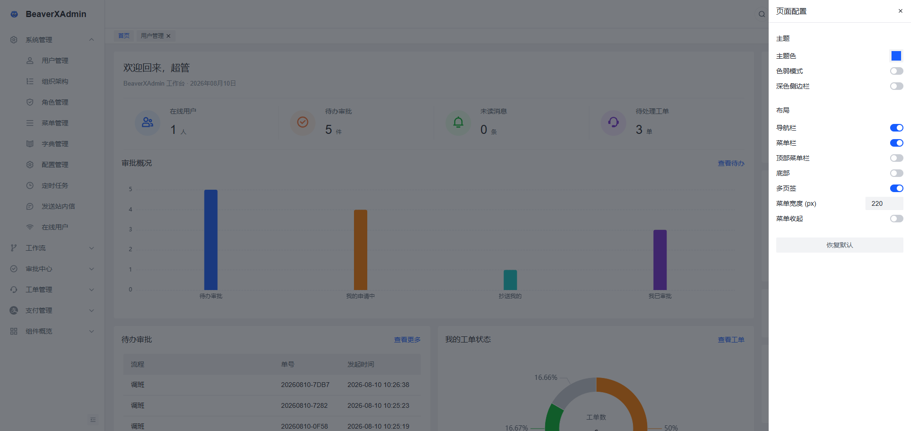
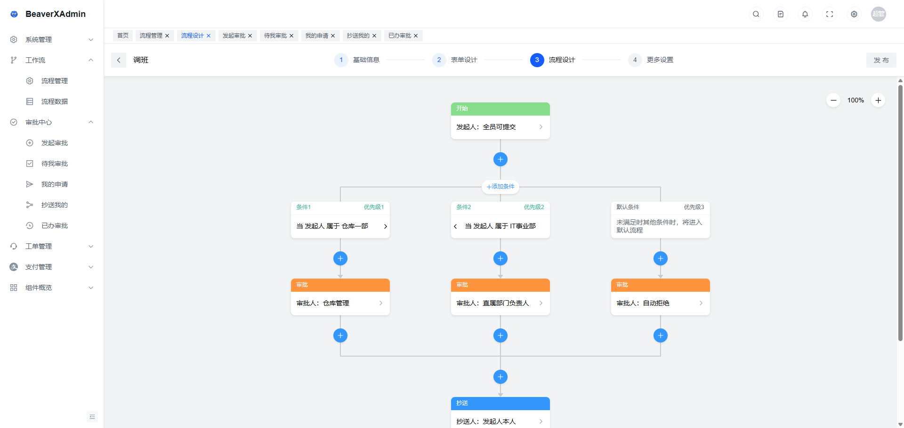
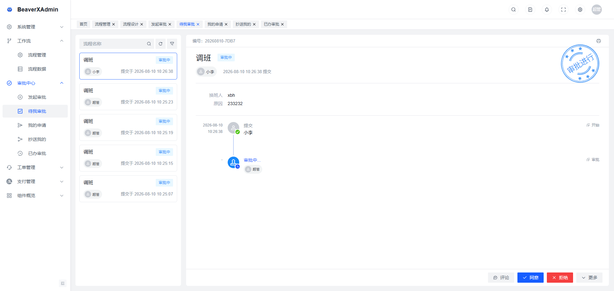
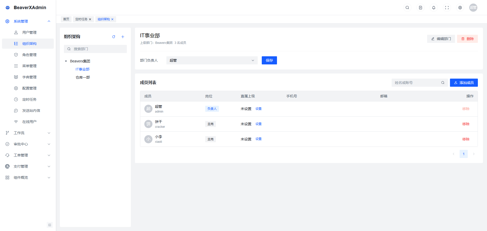

# BeaverX Vue Admin (Frontend)

> **Language**: [简体中文](README.md) | English

Admin dashboard frontend based on [Arco Design Pro Vue](https://arco.design/vue/docs/pro/start), integrated with the `BeaverX.Admin` backend API. Menus and button permissions are served from the backend—ideal for RBAC scenarios.

## Live Demo

| Item | Details |
|------|---------|
| URL | [https://beaverxadmin.com/](https://beaverxadmin.com/) |
| Account | `admin` / `Admin@123` |

> **Demo notice**: Data is reset every **5 minutes**. Do not store important information or use this environment for production.

## Implemented Features

| Capability | Description |
|------------|-------------|
| **Realtime messaging** | SignalR for unread messages, export progress, online users, force logout; device fingerprint aggregates multi-tab presence |
| **Async export** | Start export tasks and track progress/completion over realtime; download generated files |
| **Full workflow** | Process / form design, launch & approve, transfer / add-sign / reduce-sign / rollback / urge / cancel, CC & print, and other approval pages |

Also includes RBAC, dictionaries, system config, payment, tickets, scheduled jobs, component demos, and other admin pages.

## Tech Stack

| Category | Technology |
|----------|------------|
| Framework | Vue 3 + TypeScript |
| Build | Vite 8 |
| UI | Arco Design Vue |
| Router | Vue Router 4 |
| State | Pinia |
| HTTP | Axios |
| Realtime | SignalR (`@microsoft/signalr`) |

## Screenshots

The screenshots below are from the [live demo](https://beaverxadmin.com/), in sidebar order (original files in the repo `imgs/` folder).

#### Home




#### Workflow




#### Async Export


#### Role Management


#### Dictionary


#### Organization



#### Scheduled Jobs


Hangfire dashboard (`/hangfire`, separate credentials—see backend config):


#### Online Users


#### Alipay


#### Rich Text


## Requirements

- Node.js >= 20.19.0 (required by Vite 8; Node 22 LTS recommended)
- [pnpm](https://pnpm.io/) (recommended)
- Backend API running locally (default `http://localhost:5216`)

Backend: [BeaverX.Admin](https://github.com/hdonghua/BeaverX.Admin)

## Quick Start

```bash
# Install dependencies
pnpm install

# Configure backend URL (see .env.development)
# VITE_API_BASE_URL=http://localhost:5216

# Start dev server (default http://localhost:5173)
pnpm dev
```

Default account (from backend seed data): `admin` / `Admin@123`

### Common Commands

| Command | Description |
|---------|-------------|
| `pnpm dev` | Development mode |
| `pnpm build` | Type check + production build |
| `pnpm preview` | Preview production build |
| `pnpm type:check` | TypeScript check only |


## Project Structure

```
beaverx-vue-admin/
├── imgs/                   # README screenshots
├── config/                 # Vite config
├── src/
│   ├── api/                # Business APIs (by module)
│   │   └── server/
│   │       ├── auth/       # Login, profile
│   │       ├── rbac/       # Users, roles, menus
│   │       ├── system/     # Config, dict, jobs, export
│   │       ├── message/    # Site messages
│   │       ├── payment/    # Payment channels, orders
│   │       └── common/     # File upload, SignalR event types
│   ├── components/         # Global components
│   ├── config/settings.json # Layout/theme/server menu flags
│   ├── hooks/              # Composables
│   ├── locale/             # Global copy
│   ├── router/
│   │   ├── index.ts        # Router entry, / redirect
│   │   ├── guard/          # Login & permission guards
│   │   └── routes/modules/ # Static route modules
│   ├── store/modules/      # Pinia (user, app, tab-bar, etc.)
│   ├── utils/
│   │   ├── request/        # Axios interceptors, ApiResponse, token refresh
│   │   ├── auth.ts         # Token read/write
│   │   ├── server-menu.ts  # Server menu → routes/permissions
│   │   └── register-server-routes.ts
│   └── views/              # Pages (by business area)
└── .env.development        # Dev environment variables
```

## Core Concepts (Must Read)

### 1. Server-Side Menu Mode

When `menuFromServer: true` in `src/config/settings.json`:

- Sidebar menus come from `GET /api/Menu/user-menus`
- After login, routes are **registered dynamically** from backend menus (`dir-{id}` / `menu-{id}`); directories use `DEFAULT_LAYOUT`
- **`component`** lazy-loads pages under `views/`—business menus do **not** need pre-defined routes in `router/routes/modules/`
- **`path`** is the URL from the backend; on refresh, menus are re-fetched, routes re-registered, and navigation retried
- A `.vue` file matching `component` must exist under `views/`, or the menu will not work

### 2. Routing & Permissions


| File | Role |
|------|------|
| `router/guard/userLoginInfo.ts` | Redirect unauthenticated users; handle logged-in `/login` |
| `router/guard/permission.ts` | Route whitelist under server menu mode |
| `router/constants.ts` | Whitelist routes like `Home`, `403` |


Static routes in `router/routes/modules/` are mainly for **Home, component demos**, etc. when `menuFromServer: true`; business menus come from the backend.

| Field | Example | Description |
|-------|---------|-------------|
| Backend `component` | `system/user/index` | Maps to `views/system/user/index.vue` (must exist) |
| Backend `path` | `/system/user` | Registered route path (customizable) |
| Route `name` | `menu-{id}` | Auto-generated; no frontend config needed |

### 3. API Calls

- Base URL: `VITE_API_BASE_URL` in `.env.development`
- Request layer: `src/utils/request/` (interceptors in `index.ts`; `import '@/utils/request'` in `main.ts`)
- Requests include `Authorization: Bearer <token>`
- Interceptor refreshes access token before expiry; 401 triggers refresh + retry
- Business APIs: `src/api/server/<module>/`, return type `ApiResponse<T>`

**Import example:**

```ts
import axios from 'axios';
import { ApiResponse } from '@/utils/request';
import type { PagedResultDto } from '@/types/page';
import type { ConfigDto } from '@/api/server/system/config';

export function queryConfigPage(req: QueryConfigPageRequest) {
  return axios.get<unknown, ApiResponse<PagedResultDto<ConfigDto>>>(
    '/api/Config/list',
    { params: { page: req.current, pageSize: req.pageSize } }
  );
}
```

Entity IDs are GUIDs serialized as `string` in JSON; use `EntityId` (`src/types/entity-id.ts`) on the frontend.

## Layout & Global Settings

- App name, footer: `src/config/settings.json`
- Theme, dark mode, tab bar: same file, or `useAppStore().updateSettings()` at runtime

## FAQ


| Symptom | Check |
|---------|-------|
| 401 / login loop | `VITE_API_BASE_URL`, backend CORS, token expiry |
| Menu visible but 403 on page | Backend `component` matches `views/` path (e.g. `system/config/index`) |
| 404 on refresh / deep link | `permission.ts` and `register-server-routes.ts` |
| Build failure | Run `pnpm type:check` first |


## Related Repositories

- Backend API: [BeaverX.Admin](https://github.com/hdonghua/BeaverX.Admin)

## License

This project is licensed under the [MIT License](LICENSE).
