# BeaverX Vue Admin（前端）

基于 [Arco Design Pro Vue](https://arco.design/vue/docs/pro/start) 的管理后台前端，对接 `BeaverX.Admin` 后端 API。菜单与按钮权限由服务端下发，适合 RBAC 场景。

## 在线预览

| 项目 | 说明 |
|------|------|
| 地址 | [https://beaverxadmin.com/](https://beaverxadmin.com/) |
| 账号 | `admin` / `Admin@123` |

> **演示环境说明**：系统每 **5 分钟** 会定时清理并覆盖数据，请勿保存重要信息或用于生产。

## 界面展示

以下截图来自 [在线演示](https://beaverxadmin.com/)，顺序与系统侧边栏菜单一致（原图见仓库 `imgs/` 目录）。

### 首页

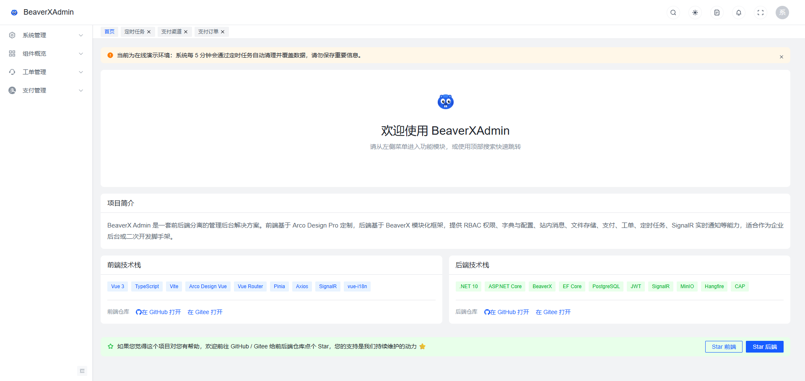

### 系统管理

#### 用户管理

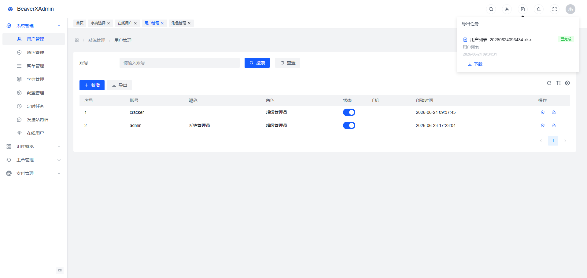

#### 角色管理

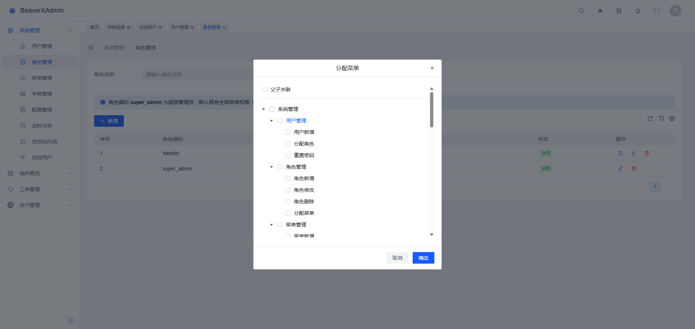

#### 字典管理

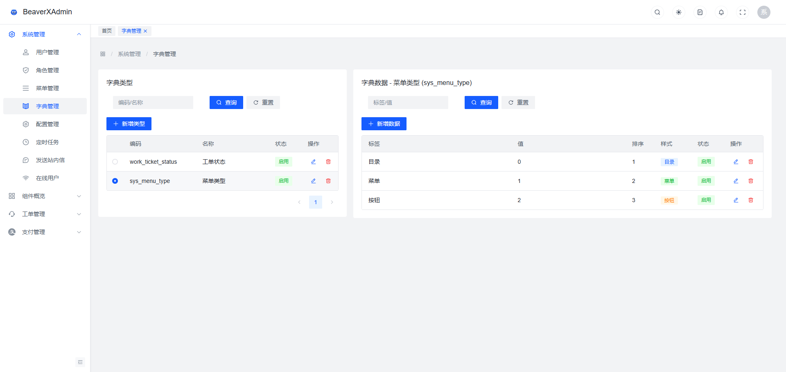

#### 配置管理

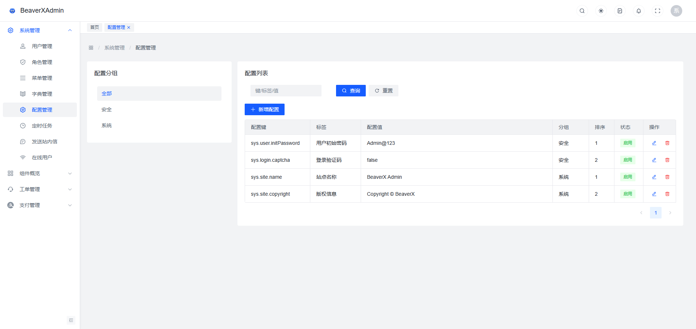

#### 定时任务

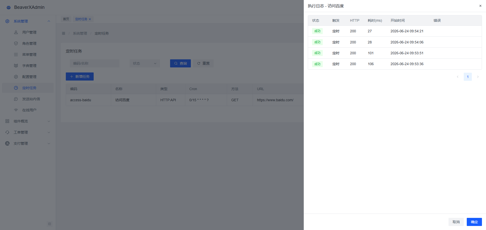

Hangfire 调度面板（`/hangfire`，独立账号，见后端配置）：

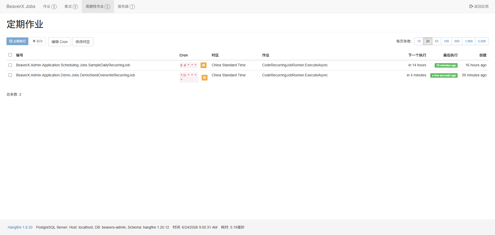

#### 在线用户

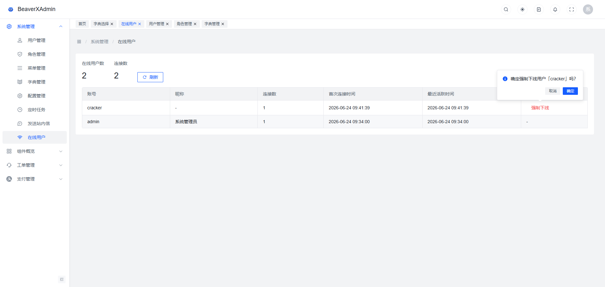

### 支付管理

#### 支付宝

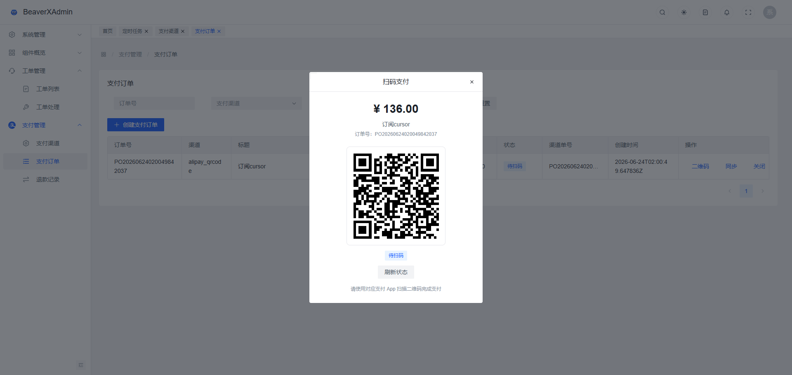

### 组件概览

#### 富文本

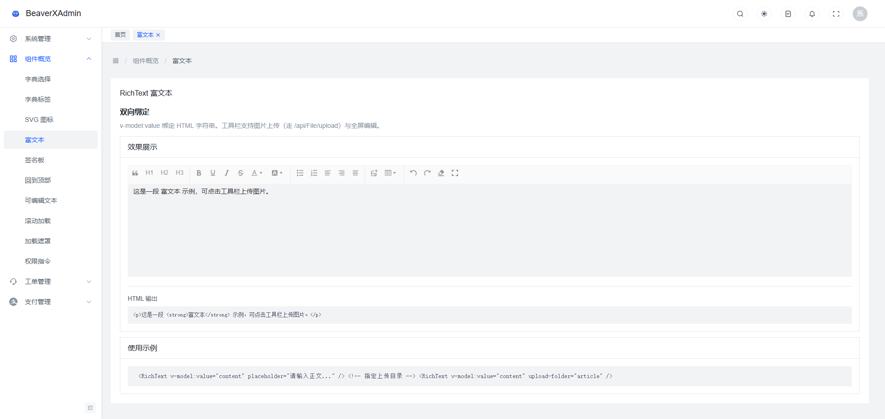

### 个人中心

#### 用户中心

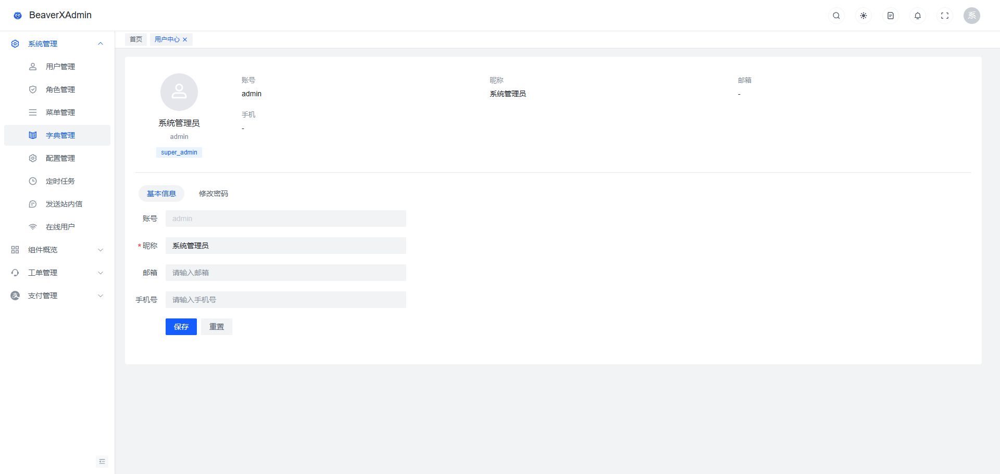

## 技术栈


| 类别   | 技术                            |
| ---- | ----------------------------- |
| 框架   | Vue 3 + TypeScript            |
| 构建   | Vite 8                        |
| UI   | Arco Design Vue               |
| 路由   | Vue Router 4                  |
| 状态   | Pinia                         |
| HTTP | Axios                         |
| 实时   | SignalR（`@microsoft/signalr`） |
| 国际化  | vue-i18n                      |


## 环境要求

- Node.js >= 20.19.0（Vite 8 要求，推荐 22 LTS）
- pnpm / npm / yarn 均可
- 本地已启动后端 API（默认 `http://localhost:5216`）

## 快速开始

```bash
# 安装依赖
npm install

# 配置后端地址（见 .env.development）
# VITE_API_BASE_URL=http://localhost:5216

# 启动开发服务（默认 http://localhost:5173）
npm run dev
```

默认账号（由后端种子数据提供）：`admin` / `Admin@123`

### 常用命令


| 命令                   | 说明              |
| -------------------- | --------------- |
| `npm run dev`        | 开发模式            |
| `npm run build`      | 类型检查 + 生产构建     |
| `npm run preview`    | 预览生产构建          |
| `npm run type:check` | 仅 TypeScript 检查 |


## 目录结构

```
beaverx-vue-admin/
├── imgs/                   # README 界面截图
├── config/                 # Vite 配置
├── src/
│   ├── api/                # 业务 API（按模块分目录）
│   │   └── server/
│   │       ├── auth/       # 登录、个人信息
│   │       ├── rbac/       # 用户、角色、菜单
│   │       ├── system/     # 配置、字典、定时任务、导出
│   │       ├── message/    # 站内消息
│   │       ├── payment/    # 支付渠道、订单
│   │       └── common/     # 文件上传、SignalR 事件类型
│   ├── components/         # 全局组件
│   ├── config/settings.json # 布局/主题/是否服务端菜单等
│   ├── hooks/              # 组合式函数
│   ├── locale/             # 全局文案
│   ├── router/
│   │   ├── index.ts        # 路由入口、/ 重定向逻辑
│   │   ├── guard/          # 登录守卫、权限守卫
│   │   └── routes/modules/ # 静态路由模块
│   ├── store/modules/      # Pinia（user、app、tab-bar 等）
│   ├── utils/
│   │   ├── request/        # Axios 拦截器、ApiResponse 类型、Token 刷新
│   │   ├── auth.ts         # Token 读写
│   │   ├── server-menu.ts  # 服务端菜单 → 路由/权限映射
│   │   └── register-server-routes.ts
│   └── views/              # 页面（按业务分目录）
└── .env.development        # 开发环境变量
```

## 核心机制（必读）

### 1. 服务端菜单模式

`src/config/settings.json` 中 `menuFromServer: true` 时：

- 侧边栏菜单来自接口 `GET /api/Menu/user-menus`
- 登录后按后端菜单 **动态注册路由**（`dir-{id}` / `menu-{id}`），目录统一挂 `DEFAULT_LAYOUT`
- **`component`** 动态加载 `views/` 页面，业务菜单 **不必** 在 `router/routes/modules/` 预定义
- **`path`** 为后端配置的访问地址；刷新时会重新拉菜单、注册路由并按 URL 重进
- `views/` 下须有与 `component` 对应的 `.vue` 文件，否则菜单不生效

### 2. 路由与权限


| 文件                              | 作用                         |
| ------------------------------- | -------------------------- |
| `router/guard/userLoginInfo.ts` | 未登录跳转登录；已登录访问 `/login` 的处理 |
| `router/guard/permission.ts`    | 服务端菜单下的路由白名单校验             |
| `router/constants.ts`           | `Home`、`403` 等白名单路由        |


静态路由 `router/routes/modules/` 在 `menuFromServer: true` 时主要用于 **Home、组件演示** 等；业务菜单由后端下发并动态注册。

| 字段 | 示例 | 说明 |
|------|------|------|
| 后端 `component` | `system/user/index` | 对应 `views/system/user/index.vue`（须存在该文件） |
| 后端 `path` | `/system/user` | 注册到 vue-router 的访问地址，可自定义 |
| 路由 name | `menu-{id}` | 自动生成，无需前端配置 |

### 3. API 调用

- 基础地址：`.env.development` 的 `VITE_API_BASE_URL`
- 请求层：`src/utils/request/`（拦截器在 `index.ts`，`main.ts` 中 `import '@/utils/request'`）
- 请求自动附带 `Authorization: Bearer <token>`
- Access Token 将过期时由拦截器调用 refresh；401 会尝试刷新后重试
- 业务接口：`src/api/server/<模块>/`，返回类型为 `ApiResponse<T>`

**目录与导入示例：**

| 模块 | 路径 | 导入示例 |
| ---- | ---- | -------- |
| 认证 | `api/server/auth/` | `import { login } from '@/api/server/auth'` |
| RBAC | `api/server/rbac/` | `import { queryUserPage } from '@/api/server/rbac/user'` |
| 系统 | `api/server/system/` | `import { queryConfigPage } from '@/api/server/system/config'` |
| 消息 | `api/server/message/` | `import { getMessageList } from '@/api/server/message/message'` |
| 支付 | `api/server/payment/` | `import { queryPaymentOrderPage } from '@/api/server/payment/order'` |
| 公共 | `api/server/common/` | `import { RealtimeEvents } from '@/api/server/common/realtime'` |

```ts
import axios from 'axios';
import { ApiResponse } from '@/utils/request';
import type { PagedResultDto } from '@/types/page';
import type { ConfigDto } from '@/api/server/system/config';

export function queryConfigPage(req: QueryConfigPageRequest) {
  return axios.get<unknown, ApiResponse<PagedResultDto<ConfigDto>>>(
    '/api/Config/list',
    { params: { page: req.current, pageSize: req.pageSize } }
  );
}
```

实体主键为雪花 ID，后端 JSON 序列化为 `string`，前端使用 `EntityId`（`src/types/entity-id.ts`）。

### 4. 实时通知（SignalR）

登录后 `default-layout` 自动连接 `/hubs/notifications`，JWT 通过 `accessTokenFactory` 传递。


| 文件                              | 职责                        |
| ------------------------------- | ------------------------- |
| `src/utils/realtime-hub.ts`     | 连接管理、`onRealtimeEvent` 订阅 |
| `src/hooks/use-realtime-hub.ts` | 布局级连接生命周期                 |
| `src/api/server/common/realtime.ts` | 事件名与 Payload 类型 |


| 事件                       | 用途              |
| ------------------------ | --------------- |
| `export.task.changed`    | 顶栏导出角标、导出列表状态更新 |
| `message.unread.changed` | 未读角标、消息列表刷新     |


已移除导出任务与未读消息的 HTTP 轮询。

### 5. 登录与跳转

- 访问 `/`：已登录 → `/home`，未登录 → `/login`
- 应用内已登录再点登录页：取消跳转，留在当前页
- 地址栏直接打开 `/login` 且已登录：重定向到首页

## 新增业务页面（标准流程）

以「配置管理」为例，完整链路如下。

### 步骤 1：静态路由

`src/router/routes/modules/system.ts` 增加子路由，`name` 保持语义清晰（如 `ConfigList`）：

```ts
{
  path: 'config',
  name: 'ConfigList',
  component: () => import('@/views/system/config/index.vue'),
  meta: { locale: 'menu.system.configList', requiresAuth: true, roles: ['*'] },
}
```

后端菜单 `component` 填 `system/config/index` 即可；`path` 可按需填写。父级 Layout 路由会自动放行。

### 步骤 2：API

在 `src/api/server/system/config.ts`（或对应模块目录下）封装 CRUD 接口，类型从 `@/utils/request` 引入 `ApiResponse`。

### 步骤 3：页面

`src/views/system/config/index.vue`，可参考 `dict`、`user` 列表页写法。

### 步骤 4：文案

`src/locale/zh-CN.ts`、`en-US.ts` 增加 `menu.system.configList`。

### 步骤 5：后端配合

后端在 **菜单管理**（或 `RbacDataSeeder`）中新增菜单：`component` 填 `system/config/index`，`path` 自定，并配置权限码。详见 [BeaverX.Admin README](https://github.com/hdonghua/BeaverX.Admin)。

> 日常加页面：前端补静态路由 + 视图 + API；后端在菜单管理配好 `component` / 权限并分配给角色即可，**不必改** `server-menu.ts`。

## 布局与全局配置

- 系统名称、页脚：`src/config/settings.json`
- 主题色、暗色模式、Tab 栏等：同上，或在运行时通过 `useAppStore().updateSettings()` 修改

## 常见问题


| 现象             | 排查                                               |
| -------------- | ------------------------------------------------ |
| 接口 401 / 一直跳登录 | 检查 `VITE_API_BASE_URL`、后端 CORS、Token 是否过期        |
| 有菜单但进页面 403    | 检查后端 `component` 是否与 `views/` 路径一致（如 `system/config/index`） |
| 刷新外链/子路由 404   | 检查 `permission.ts` 与 `register-server-routes.ts` |
| 构建失败           | 先执行 `npm run type:check` 定位 TS 错误                |


## 相关仓库

- 后端 API：[BeaverX.Admin](https://github.com/hdonghua/BeaverX.Admin)

